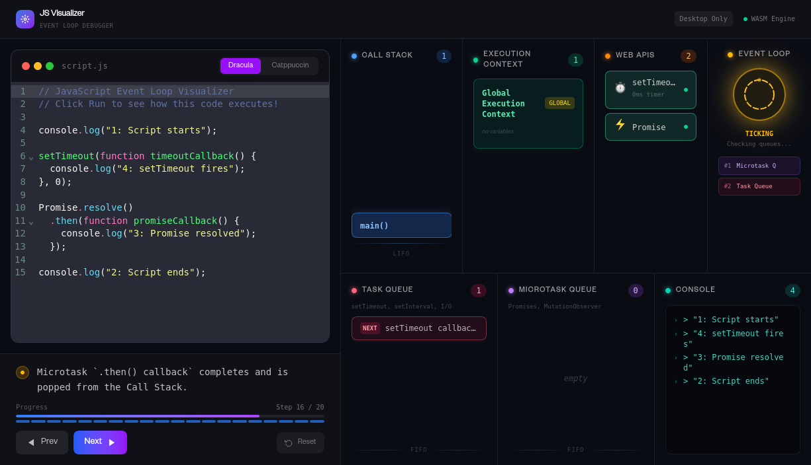

<div align="center">

<br />

```
   ██╗███████╗    ██╗   ██╗██╗███████╗██╗   ██╗ █████╗ ██╗     ██╗███████╗███████╗██████╗
   ██║██╔════╝    ██║   ██║██║██╔════╝██║   ██║██╔══██╗██║     ██║╚══███╔╝██╔════╝██╔══██╗
   ██║███████╗    ██║   ██║██║███████╗██║   ██║███████║██║     ██║  ███╔╝ █████╗  ██████╔╝
██ ██║╚════██║    ╚██╗ ██╔╝██║╚════██║██║   ██║██╔══██║██║     ██║ ███╔╝  ██╔══╝  ██╔══██╗
╚█████║███████║    ╚████╔╝ ██║███████║╚██████╔╝██║  ██║███████╗██║███████╗███████╗██║  ██║
 ╚════╝╚══════╝     ╚═══╝  ╚═╝╚══════╝ ╚═════╝ ╚═╝  ╚═╝╚══════╝╚═╝╚══════╝╚══════╝╚═╝  ╚═╝
```

**A production-grade, desktop-only JavaScript Event Loop Debugger**

Visualize the Call Stack, Execution Context, Web APIs, Task Queue, Microtask Queue,
and Event Loop — all in real time, step by step.

<br />

[](https://js-visualizer.gouranga.eu.org)
[](./LICENSE)
[](https://www.typescriptlang.org/)
[](https://react.dev/)
[](https://tailwindcss.com/)
[](https://greensock.com/gsap/)

</img>

</div>

---

## What is JS Visualizer?

Most developers learn about the JavaScript event loop from blog posts or videos. JS Visualizer makes it **interactive and tactile** — paste real code, click **Run**, then step through each moment:

- Watch `setTimeout` hand its callback off to Web APIs and then the Task Queue
- See how `Promise.resolve().then(...)` lands in the Microtask Queue **before** any setTimeout callback
- Observe the Event Loop drain the Microtask Queue after every synchronous task
- Track which variables exist in which Execution Context at every point in time

---

## Features

| Feature | Details |
|---------|---------|
| 📝 **CodeMirror 6 Editor** | Syntax highlighting, autocomplete, bracket matching |
| 🎨 **Two themes** | Dracula (default) and Catppuccin Macchiato, switchable at runtime |
| 📚 **Call Stack** | Push/pop animations with GSAP, active frame highlighted |
| 🧠 **Execution Context** | Scope frames with live variable bindings per step |
| 🌐 **Web APIs panel** | Delegated async operations with live status indicators |
| 📬 **Task Queue** | Macro-task queue — setTimeout, setInterval, I/O callbacks |
| ⚡ **Microtask Queue** | Higher-priority queue — Promises, queueMicrotask |
| 🔄 **Event Loop** | Animated ring that activates when the loop checks queues |
| 🖥️ **Console output** | Simulated `console.log` output per step |
| ⏩ **Step scrubber** | Click any position on the timeline to jump to that step |
| 🔒 **Desktop only** | Optimised for ≥ 1280px — mobile users see a clear gate |

---

## Tech Stack

| Concern | Technology | Why |
|---------|-----------|-----|
| UI | React 19 + TypeScript (strict) | Component model maps directly to runtime panels |
| Styling | Tailwind CSS v4 | Zero raw CSS — entire UI is utility classes |
| State | Zustand | Minimal boilerplate, selector subscriptions, no Provider |
| Animations | GSAP 3 | Frame-accurate, imperative DOM control |
| Editor | CodeMirror 6 (`@uiw/react-codemirror`) | Extension API for custom line decorations |
| Build | Vite | Sub-second HMR, native ESM |
| Notifications | React Hot Toast | Lightweight and themeable |

---

## Getting Started

### Prerequisites

- **Node.js** ≥ 20.x
- **pnpm** ≥ 10.x

### Installation

```bash
# Clone
git clone https://github.com/GourangDasSamrat/js-visualizer.git
cd js-visualizer

# Install
pnpm install

# Develop
pnpm run dev
```

Open [http://localhost:5173](http://localhost:5173) in your browser.

```bash
# Production build
pnpm run build
```

---

## How to Use

1. **Paste or edit** JavaScript in the left editor panel.
2. Click **Run Visualization** — all steps are pre-computed instantly.
3. Use **Next** / **Prev** to step through each runtime event.
4. Click any segment of the **progress scrubber** to jump to any step.
5. Read the **description bar** — it explains exactly what is happening.
6. Click **Reset** to edit and run again.

### Try these snippets

```javascript
// Classic event loop order demo
console.log("start");
setTimeout(() => console.log("timeout"), 0);
Promise.resolve().then(() => console.log("microtask"));
console.log("end");
// Output order: start → end → microtask → timeout
```

```javascript
// Async/await suspension
async function load() {
  console.log("loading...");
  const result = await fetch("https://api.example.com");
  console.log("done");
}
load();
console.log("sync continues here first");
```

---

## Project Structure

```
js-visualizer/
├── docs/
│   ├── ARCHITECTURE.md      ← System design + Mermaid diagrams
│   ├── CONTRIBUTING.md      ← How to contribute
│   ├── CODE_OF_CONDUCT.md   ← Community standards
│   └── SECURITY.md          ← Vulnerability reporting
├── src/
│   ├── components/
│   │   ├── Editor/          ← CodeMirror editor panel
│   │   ├── Visualizer/      ← 6 live runtime panels
│   │   ├── Controls/        ← Navigation controls + scrubber
│   │   └── Layout/          ← App shell + mobile gate
│   ├── engine/              ← JS runtime simulation core
│   ├── store/               ← Zustand global state
│   ├── types/               ← Shared TypeScript interfaces
│   └── styles/              ← Global CSS (Tailwind entry)
├── README.md
├── LICENSE
└── package.json
```

Full architectural breakdown with Mermaid diagrams → [docs/ARCHITECTURE.md](./docs/ARCHITECTURE.md)

---

## Documentation

| Document | Description |
|----------|-------------|
| [docs/ARCHITECTURE.md](./docs/ARCHITECTURE.md) | System design, data flow, component tree, Mermaid diagrams |
| [docs/CONTRIBUTING.md](./docs/CONTRIBUTING.md) | Dev setup, branch strategy, coding standards, PR process |
| [docs/CODE_OF_CONDUCT.md](./docs/CODE_OF_CONDUCT.md) | Community standards and enforcement guidelines |
| [docs/SECURITY.md](./docs/SECURITY.md) | Vulnerability reporting policy and security scope |

---

## Contributing

All contributions are welcome — bug reports, feature ideas, documentation fixes, and pull requests.

Please read [docs/CONTRIBUTING.md](./docs/CONTRIBUTING.md) before opening a PR.

---

## License

Distributed under the **MIT License**. See [LICENSE](./LICENSE) for the full text.

---

## Author

<div align="center">

**Gourang Das Samrat**

[](mailto:gouranga.samrat@gmail.com)
[](https://github.com/GourangDasSamrat/js-visualizer)
[](https://js-visualizer.gouranga.eu.org)

</div>

---

<div align="center">

_Built to make the JavaScript event loop finally make sense._

⭐ **Star this repo if it helped you understand how JavaScript actually works.**

</div>
